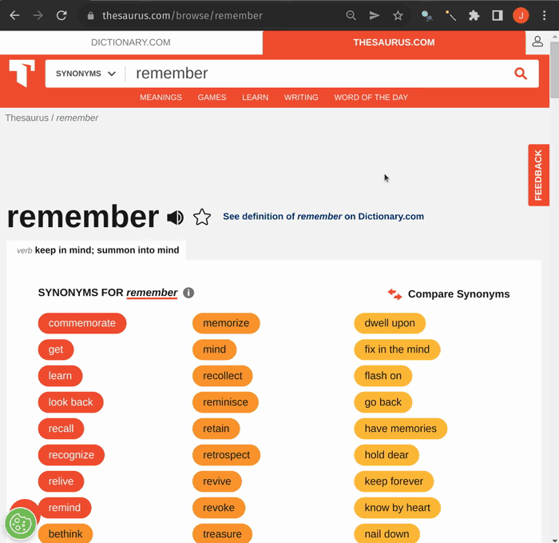

<b>This add-on was funded by the Anki Mastery Course. Please consider supporting our work using the links below so we can continue to fund add-on projects like this.</b>

You must be on Anki **2.1.55+** to use this add-on

## Add-on description

This add-on allows adding custom buttons to the editor that help with the creation of notes.
The buttons can:

- get resources from from various websites (text, images, etc.)
- do formatting tasks

Creating buttons takes some effort but you can share them easily. You can also batch process notes using the buttons.

## Screenshots

Here you can see all the buttons that are included with the add-on from the start.
The ones used here are:
- Giphy (gets gif from giphy.com)
- Google image
- English to Italian (using yandex api, you can choose other languages)

(Each button has a description which can be accessed by pressing the Alt key, clicking on it and selecting the the Description tab)

### Search buttons

There are a couple of buttons with "search" at the end of their name, for example "wiki search". Say you want to look for a term on wikipedia. The term is in the first field of the note and you click on "wiki summary" but you get no results. With the "wiki search" button you get similiar terms that have entries on wikiepdia. You can choose one by selecting it with the mouse. Then you can click "wiki summary" again.

(This process could be made more elegant in the future by adding a popup window with results.)

### Configuration

You can open the Button Editor for each button by pressing the Alt key and clicking on it (or alternatively from the Manage Buttons menu).
- in the Description tab you can read more about what the button does and how
  to use it
- the Debug tab shows the steps the button performs and helps with creating
  custom buttons

### Formatting

This video demonstrates some of the formatting tasks the add-on can do. The first show button unwraps all clozes (useful when converting a Cloze note to another note type), the second one inserts a symbol (which can of course be modified to any other symbol) and the third one converts youtube links to embedded youtube videos.

### Batch Processing

  
  

All buttons can be applied to many cards at once from the Browser. Select any number of cards, right click and choose the button you want to apply to them.

## How to create a simple Scraper button

Scraper buttons get data (text, images, etc.) from websites and put it on notes. This section describes how to create a simple Scraper button. Note that this method will not work for every website and for some you will need to know about e.g. regular expressions, css selectors or json paths.

For the add-on to be able to get the stuff you want from the website, the url of the site has to contain the term you want to search for, e.g.
https://www.thesaurus.com/browse/remember
contains "remember" and the website display synonyms for the word "remember".
If you replace "remember" with "learn" it will show synonyms for "learn".
This means that the websites you will most likely use are encyclopedias, dictionaries, and such.

Let's put https://www.thesaurus.com/browse/TERM into the url field.
TERM will be replaced by the input term in the first field of the note (or the currently selected text).

Now we need to tell the button which parts of the page we need. In the case of thesaurus we only want the synonyms.
We can do this by providing a appropriate css selector.
Css selectors are paths to html elements on a website. There are tools that let you get css selectors using point-and-click, for example the [SelectorGadget](https://chrome.google.com/webstore/detail/selectorgadget/mhjhnkcfbdhnjickkkdbjoemdmbfginb) Chrome extension.
Here's how the process can look:

Activate the Selector Gadget extension, then select the element you want. All the elements that are highlighted yellow match the current selector. We don't want the antonyms and get rid of them by clicking on one of them. Then we copy the selector.

We can leave all other settings as is and test the button.

If we want we can reduce the numbers of synonyms we get by changing the "max result groups" setting in the Output tab to something like 3.

<b>Problems, Bugs, Errors, Improvements</b>
If you find a serious bug, please submit it on <a href="https://github.com/ankipalace/" rel="nofollow">Github</a> or email us at ankingmed@gmail.com. Please remember that we are not coders and thus may not be able to provide support.

<b>Changelog:</b>
 
2021\*\*\*: Initial Release

<b>Please consider checking out our:</b>
<a href="https://www.youtube.com/theanking/playlists" rel="nofollow">YouTube Channel</a>- <i>How to use Anki for beginners and advanced users.</i>
<a href="https://www.instagram.com/ankingmed" rel="nofollow">Instagram</a>/<a href="https://www.facebook.com/ankingmed" rel="nofollow">Facebook</a>: <i>@Ankingmed</i>
<a href="https://www.ankingmed.com" rel="nofollow">www.AnKingMed.com</a>- <i>Recommended add-ons, tutorials and more including <b>how to download 40+ add-ons in &lt; 5min</b></i>
<a href="https://www.theanking.com/anking-memberships" rel="nofollow">Patreon</a>- <i>Support our work and <b>get individualized Anki help!</b></i>

   
                      
   

 
<b>Check out our <a href="https://www.theanking.com/anki-mastery-course/?utm_source=anking_addon_template-on&amp;utm_medium=anki_add-on_page&amp;utm_campaign=mastery_course" rel="nofollow">Anki Mastery Course</a>! (The source of funding for this project)</b> 

## Development Notes
Run `python scripts/build.py` to make `mypy` checks work.
